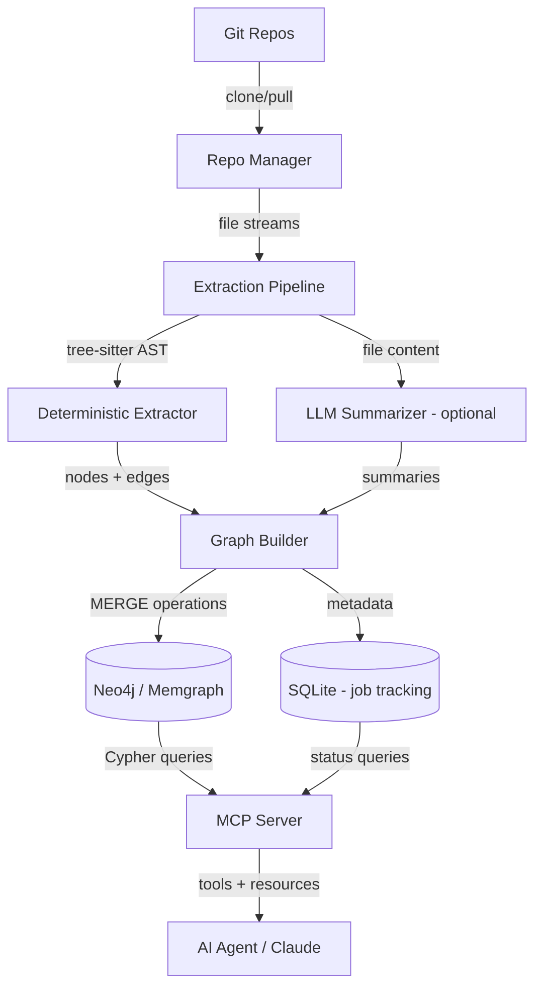

# EKG PRD Analysis — Is This Worth Building?

## TL;DR Verdict

**Yes, this is worth building — but the PRD as written will lead you into a swamp.** The *problem* is real and valuable: engineering orgs drown in implicit knowledge buried across repos. A graph-based system that surfaces dependencies and impact is genuinely useful. However, the PRD is underspecified in the places that matter most and overspecified in the places that don't matter yet.

If you're scoping this to **backend/MCP only** (no UI, no visualization), you can build something genuinely useful in ~2-3 weeks. But you need to make sharper architectural choices than what this PRD outlines.

---

## What the PRD Gets Right

| Aspect | Assessment |
|---|---|
| **Problem statement** | Solid. "Where is X used?" and "What breaks if Y changes?" are real, recurring questions. |
| **Local-first approach** | Smart for a POC. Avoids infra overhead and keeps iteration fast. |
| **Deterministic-first extraction** | Correct instinct. AST > LLM for structural facts. |
| **Non-goals** | Well-scoped. Explicitly excluding real-time monitoring and multi-language is wise. |
| **Phased roadmap** | Reasonable progression. Ship graph basics before embeddings/reasoning. |

---

## Critical Gaps & Problems

### 1. Extraction Engine is Dangerously Vague

> [!CAUTION]
> "AST-based parsing" is stated but not designed. This is the hardest part of the entire system and it gets 6 lines in the PRD.

Key unanswered questions:
- **Which language(s)?** "Start with one language" — which one? Node.js/TypeScript? Java? Python? The parser design is fundamentally different for each.
- **What AST tooling?** Tree-sitter? ts-morph? Babel? Language-specific compilers?
- **How do you detect service boundaries?** This is non-trivial. Is a "service" a repo? A folder? A `package.json`? A Docker container? A Kubernetes deployment?
- **How do you detect database usage?** Regex on `couchbase` imports? Tracing ORM configurations? Connection string parsing? Each approach has wildly different accuracy.
- **How do you detect API calls between services?** HTTP client calls with hardcoded URLs? Service discovery configs? OpenAPI specs? gRPC proto files?

Without answering these, you'll spend 80% of your time on extraction and still get garbage data.

### 2. Graph Schema is Too Rigid, Too Early

The node types (`Service`, `API`, `Database`, `Repo`, `File`) look clean on paper but will collapse under real-world code:

- What's the node type for a shared library that isn't a "service"?
- Where do environment variables fit? Config files?
- How do you represent a service that uses *two* databases?
- What about message queues (Kafka, RabbitMQ) — are they "databases"?

The PRD commits to a schema before understanding the data. This is backwards.

### 3. Incremental Updates Are Hand-Waved

> "Supports incremental updates (on new commits)"

This is one line for what is actually a complex problem:
- How do you detect *what changed* in a commit?
- Do you re-parse only changed files? What about transitive impacts?
- How do you handle deleted services/files — orphan node cleanup?
- What about branch-based development — do you track `main` only?

### 4. Query Layer Conflates Two Very Different Things

"Natural language queries" and "graph queries" are fundamentally different systems:
- Graph queries = Cypher/Gremlin, deterministic, fast
- NL queries = LLM interpretation → graph query translation, probabilistic, slow

The PRD treats them as equivalent. They're not. For a backend/MCP, you need to decide: **are you building a graph query API or an NL→graph translation layer?** For a POC, pick one.

### 5. The "Reasoning Layer" is Premature

> [!WARNING]
> Adding an LLM reasoning layer on top of a graph that might have incorrect relationships is a recipe for confidently wrong answers.

Fix the data quality first. Reasoning is Phase 4 at best.

### 6. No Mention of MCP at All

The PRD mentions a REST API but you want an MCP server. These are different interface contracts. MCP has specific patterns:
- **Tools** (actions the LLM can invoke)
- **Resources** (data the LLM can read)
- **Prompts** (pre-built query templates)

The PRD's REST endpoints (`/search`, `/impact`, `/dependencies`) need to be reconceived as MCP tools.

---

## What I Would Build Differently

### Architecture: Backend/MCP-Only EKG



---

### Key Differences from the PRD

#### 1. Tree-sitter as the Universal Parser

Instead of vague "AST-based parsing", use **tree-sitter** with language-specific grammars. It gives you:
- Consistent AST API across languages
- Incremental parsing (only re-parse changed regions)
- Battle-tested grammars for 100+ languages

For a POC targeting Node.js/TypeScript:
```
tree-sitter-typescript → extract imports, exports, class definitions
tree-sitter-javascript → extract require(), HTTP client calls
```

#### 2. Schema-Last, Not Schema-First

Instead of pre-defining node types, **extract raw facts first**, then cluster them into a schema:

```
Phase 1: Extract raw triples
  (file:auth.ts) → IMPORTS → (module:express)
  (file:auth.ts) → EXPORTS → (function:authenticate)
  (file:user.service.ts) → CALLS → (url:http://auth-service/verify)
  (file:db.config.ts) → CONNECTS_TO → (dsn:couchbase://localhost)

Phase 2: Infer higher-level nodes
  Cluster files by repo/directory → Service nodes
  Cluster DSNs → Database nodes
  Cluster URLs → API nodes
```

This way the graph reflects reality instead of forcing reality into boxes.

#### 3. MCP Tools Instead of REST Endpoints

Design the interface as MCP tools from the start:

| MCP Tool | Purpose | Example Input |
|---|---|---|
| `search_codebase` | Find where something is used | `{"query": "couchbase", "type": "database"}` |
| `get_dependencies` | Get direct + transitive deps | `{"service": "UserService", "depth": 2}` |
| `analyze_impact` | What breaks if X changes | `{"node": "AuthService", "change_type": "api_change"}` |
| `get_service_summary` | Overview of a service | `{"service": "PaymentService"}` |
| `list_services` | Enumerate all known services | `{}` |
| `ingest_repo` | Trigger ingestion of a repo | `{"url": "git@...", "branch": "main"}` |
| `get_ingestion_status` | Check processing status | `{"repo": "RepoA"}` |

#### 4. SQLite for Metadata, Graph DB for Relationships

The PRD says "graph database" but doesn't acknowledge that you also need relational storage for:
- Ingestion job tracking (which repos processed, when, status)
- File metadata (last modified, hash, language)
- Configuration (tokens, repo URLs, parsing rules)

**Use SQLite for operational data, Neo4j/Memgraph for the knowledge graph.** Don't force everything into the graph.

#### 5. Smarter Incremental Updates

Instead of the PRD's hand-wave:

```
1. git fetch + git diff HEAD..origin/main → changed file list
2. For each changed file:
   a. Re-parse with tree-sitter
   b. Diff old facts vs new facts
   c. DELETE stale edges, MERGE new edges
3. For deleted files:
   a. Remove all edges originating from that file
   b. Garbage-collect orphan nodes
4. Store commit SHA as watermark in SQLite
```

#### 6. Skip the Reasoning Layer Entirely (for now)

The MCP server **is** the reasoning layer. The AI agent (Claude, etc.) connecting via MCP does the reasoning. You just need to give it clean, queryable data. Don't build a second LLM layer on top.

---

### Proposed Lean Roadmap (Backend/MCP Only)

| Phase | Duration | Deliverable |
|---|---|---|
| **P1: Skeleton** | 3-4 days | MCP server scaffold, Neo4j connection, `ingest_repo` tool that clones + stores file list |
| **P2: Extraction** | 5-7 days | Tree-sitter pipeline for JS/TS. Extract imports, exports, HTTP calls, DB connections. Build graph. |
| **P3: Query Tools** | 3-4 days | `search_codebase`, `get_dependencies`, `analyze_impact` MCP tools with Cypher queries |
| **P4: Incremental** | 3-4 days | Diff-based re-ingestion, orphan cleanup, job tracking in SQLite |
| **P5: Polish** | 2-3 days | Error handling, logging, multi-repo support, documentation |

**Total: ~2-3 weeks** for a working backend/MCP that an AI agent can use to answer dependency and impact questions.

---

### Tech Stack I'd Use

| Component | Choice | Why |
|---|---|---|
| **Language** | TypeScript | Matches your ecosystem, good MCP SDK support |
| **MCP SDK** | `@modelcontextprotocol/sdk` | Official SDK, well-maintained |
| **AST Parser** | `tree-sitter` + `node-tree-sitter` | Fast, incremental, multi-language |
| **Graph DB** | **Memgraph** (or Neo4j Community) | Memgraph is lighter for local, Cypher-compatible |
| **Metadata DB** | SQLite via `better-sqlite3` | Zero-config, embedded, fast |
| **Git operations** | `simple-git` | Clean API, handles auth tokens |
| **LLM (optional)** | Called via MCP client, not embedded | Keep the server dumb, let the agent be smart |

---

## Final Assessment

| Dimension | PRD Score | Notes |
|---|---|---|
| **Problem Worth Solving** | 9/10 | Real pain, real value |
| **Architecture Clarity** | 4/10 | Too vague where it matters, too specific where it doesn't |
| **Extraction Design** | 2/10 | The hardest part is barely addressed |
| **Feasibility (as written)** | 5/10 | Buildable but you'll redesign mid-flight |
| **MCP Readiness** | 1/10 | Not mentioned at all |
| **Overall Build Worthiness** | **7/10** | Worth building, but rewrite the technical spec |

> [!IMPORTANT]
> **Bottom line:** Build it, but throw away everything below section 6 of this PRD and redesign the technical architecture with the MCP-first, extraction-focused approach above. The problem is valuable. The solution design needs surgery.
