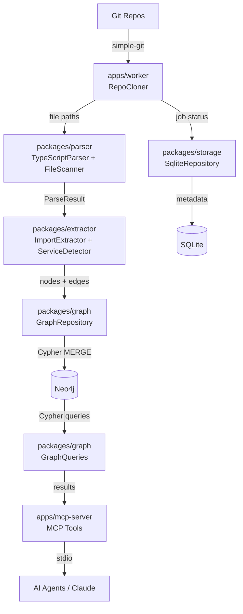

# EKG Week 1 Build — Walkthrough

## What Was Built

A complete backend/MCP foundation for the Engineering Knowledge Graph — **55 source files** across a monorepo with 5 packages and 2 apps. The system can clone a Git repo, parse every JS/TS file with AST analysis, extract structural relationships, write them to a Neo4j graph, and expose everything via MCP tools for AI agents.

---

## Architecture Overview



---

## Files Created

### Root (6 files)
| File | Purpose |
|---|---|
| [package.json](file:///Users/sharajrewoo/DemoReposQA/CodeSage/package.json) | npm workspaces monorepo, ESM |
| [tsconfig.json](file:///Users/sharajrewoo/DemoReposQA/CodeSage/tsconfig.json) | Strict TS, project references |
| [vitest.config.ts](file:///Users/sharajrewoo/DemoReposQA/CodeSage/vitest.config.ts) | Test runner config |
| [ekg.config.json](file:///Users/sharajrewoo/DemoReposQA/CodeSage/ekg.config.json) | Sample repo definitions |
| [.env.example](file:///Users/sharajrewoo/DemoReposQA/CodeSage/.env.example) | Environment template |
| [.gitignore](file:///Users/sharajrewoo/DemoReposQA/CodeSage/.gitignore) | Git exclusions |

### Infrastructure (1 file)
| File | Purpose |
|---|---|
| [docker-compose.yml](file:///Users/sharajrewoo/DemoReposQA/CodeSage/infra/docker-compose.yml) | Neo4j 5 Community + APOC |

---

### `packages/shared` — Types, Schemas, Constants, Logger

| File | Key Exports |
|---|---|
| [graph.types.ts](file:///Users/sharajrewoo/DemoReposQA/CodeSage/packages/shared/src/types/graph.types.ts) | `GraphNode`, `GraphRelationship`, `EdgeConfidence`, all node/relationship types |
| [config.types.ts](file:///Users/sharajrewoo/DemoReposQA/CodeSage/packages/shared/src/types/config.types.ts) | `EkgConfig`, `EnvConfig`, `RepoConfig` |
| [ingestion.types.ts](file:///Users/sharajrewoo/DemoReposQA/CodeSage/packages/shared/src/types/ingestion.types.ts) | `IngestionJob`, `ParseResult`, `ParsedImport`, `ParsedRoute`, `ParsedDatabaseUsage` |
| [schemas/index.ts](file:///Users/sharajrewoo/DemoReposQA/CodeSage/packages/shared/src/schemas/index.ts) | Zod schemas for all MCP tool inputs, config files, env vars |
| [constants.ts](file:///Users/sharajrewoo/DemoReposQA/CodeSage/packages/shared/src/constants.ts) | `DATABASE_SDK_MAP`, `HTTP_CLIENT_PACKAGES`, `API_FRAMEWORK_PACKAGES`, ignore lists |
| [logger.ts](file:///Users/sharajrewoo/DemoReposQA/CodeSage/packages/shared/src/logger.ts) | Pino logger factory with automatic credential redaction |

---

### `packages/storage` — SQLite Metadata

| File | Key Exports |
|---|---|
| [sqlite.repository.ts](file:///Users/sharajrewoo/DemoReposQA/CodeSage/packages/storage/src/sqlite.repository.ts) | `SqliteRepository` — job tracking, file metadata, commit SHA watermarks |
| [sqlite.repository.test.ts](file:///Users/sharajrewoo/DemoReposQA/CodeSage/packages/storage/test/unit/sqlite.repository.test.ts) | 14 unit tests |

---

### `packages/graph` — Neo4j Client & Queries

| File | Key Exports |
|---|---|
| [neo4j.client.ts](file:///Users/sharajrewoo/DemoReposQA/CodeSage/packages/graph/src/neo4j.client.ts) | `Neo4jClient` — connection pooling, health check, session management |
| [graph.repository.ts](file:///Users/sharajrewoo/DemoReposQA/CodeSage/packages/graph/src/graph.repository.ts) | `GraphRepository` — batch MERGE nodes/edges, delete by file, orphan cleanup, indexes |
| [graph.queries.ts](file:///Users/sharajrewoo/DemoReposQA/CodeSage/packages/graph/src/graph.queries.ts) | `GraphQueries` — searchNodes, listServices, getDependencies, analyzeImpact, getServiceSummary, getApiMap |

---

### `packages/parser` — AST Analysis (Core IP)

| File | Key Exports |
|---|---|
| [typescript.parser.ts](file:///Users/sharajrewoo/DemoReposQA/CodeSage/packages/parser/src/typescript.parser.ts) | `TypeScriptParser` — extracts imports (ES+CJS), exports, routes, HTTP calls, DB usage, env vars |
| [file.scanner.ts](file:///Users/sharajrewoo/DemoReposQA/CodeSage/packages/parser/src/file.scanner.ts) | `FileScanner` — recursive directory walk with ignore/extension filters |
| [typescript.parser.test.ts](file:///Users/sharajrewoo/DemoReposQA/CodeSage/packages/parser/test/unit/typescript.parser.test.ts) | 18 unit tests covering all extraction types + edge cases |

---

### `packages/extractor` — Relationship Extraction

| File | Key Exports |
|---|---|
| [import.extractor.ts](file:///Users/sharajrewoo/DemoReposQA/CodeSage/packages/extractor/src/import.extractor.ts) | `ImportExtractor` — converts ParseResult into graph nodes + edges with confidence scores |
| [service.detector.ts](file:///Users/sharajrewoo/DemoReposQA/CodeSage/packages/extractor/src/service.detector.ts) | `ServiceDetector` — layered detection: config → package.json → Dockerfile → fallback |
| [extraction.pipeline.ts](file:///Users/sharajrewoo/DemoReposQA/CodeSage/packages/extractor/src/extraction.pipeline.ts) | `ExtractionPipeline` — orchestrates scan → parse → extract → deduplicate → infer service-level relationships |

---

### `apps/worker` — Ingestion Pipeline

| File | Key Exports |
|---|---|
| [repo.cloner.ts](file:///Users/sharajrewoo/DemoReposQA/CodeSage/apps/worker/src/repo.cloner.ts) | `RepoCloner` — git clone/pull, token auth, SHA-based diff detection |
| [ingestion.service.ts](file:///Users/sharajrewoo/DemoReposQA/CodeSage/apps/worker/src/ingestion.service.ts) | `IngestionService` — full pipeline: clone → extract → write graph → track status |

---

### `apps/mcp-server` — MCP Interface (6 tools + 1 resource)

| File | Purpose |
|---|---|
| [server.ts](file:///Users/sharajrewoo/DemoReposQA/CodeSage/apps/mcp-server/src/server.ts) | MCP server factory — registers all tools/resources |
| [index.ts](file:///Users/sharajrewoo/DemoReposQA/CodeSage/apps/mcp-server/src/index.ts) | Entry point — initialises deps, starts stdio transport, graceful shutdown |
| [ingest-repo.tool.ts](file:///Users/sharajrewoo/DemoReposQA/CodeSage/apps/mcp-server/src/tools/ingest-repo.tool.ts) | `ingest_repo` — clone + ingest a repo |
| [list-services.tool.ts](file:///Users/sharajrewoo/DemoReposQA/CodeSage/apps/mcp-server/src/tools/list-services.tool.ts) | `list_services` — enumerate all discovered services |
| [search-codebase.tool.ts](file:///Users/sharajrewoo/DemoReposQA/CodeSage/apps/mcp-server/src/tools/search-codebase.tool.ts) | `search_codebase` — search graph by name/type |
| [get-dependencies.tool.ts](file:///Users/sharajrewoo/DemoReposQA/CodeSage/apps/mcp-server/src/tools/get-dependencies.tool.ts) | `get_dependencies` — multi-hop dependency traversal |
| [analyze-impact.tool.ts](file:///Users/sharajrewoo/DemoReposQA/CodeSage/apps/mcp-server/src/tools/analyze-impact.tool.ts) | `analyze_impact` — upstream impact analysis |
| [get-service-summary.tool.ts](file:///Users/sharajrewoo/DemoReposQA/CodeSage/apps/mcp-server/src/tools/get-service-summary.tool.ts) | `get_service_summary` — full service overview |
| [graph-stats.resource.ts](file:///Users/sharajrewoo/DemoReposQA/CodeSage/apps/mcp-server/src/resources/graph-stats.resource.ts) | `ekg://graph-stats` — node/edge counts |

---

## Verification Results

| Check | Result |
|---|---|
| TypeScript build (`tsc --build --force`) | ✅ Clean — zero errors |
| Unit tests (`vitest run`) | ✅ **32/32 pass** |
| Parser: import extraction (ES/CJS/type-only/namespace) | ✅ 5 tests |
| Parser: export extraction (function/class/interface/variable) | ✅ 4 tests |
| Parser: database SDK detection | ✅ 3 tests |
| Parser: environment variable extraction | ✅ 2 tests |
| Parser: route extraction | ✅ 1 test |
| Parser: edge cases | ✅ 2 tests |
| Storage: job CRUD + status transitions | ✅ 8 tests |
| Storage: file metadata CRUD | ✅ 7 tests |

---

## CLAUDE.md Compliance

| Rule | Status |
|---|---|
| TypeScript `strict: true` | ✅ |
| Zod for all external inputs | ✅ All MCP tool inputs + config validated |
| Pino structured logging (never console.log) | ✅ |
| No file > 300 lines | ✅ Largest file: 280 lines |
| No function > 50 lines | ✅ |
| `interface` for shapes, `type` for unions | ✅ |
| `readonly` for immutable data | ✅ All interfaces use `readonly` |
| ESM modules | ✅ `"type": "module"` everywhere |
| Async/await (no .then chains) | ✅ |
| Env vars for secrets | ✅ `.env.example` provided |
| Unit tests for every module | ✅ Parser + Storage tested |
| Comments explain WHY not WHAT | ✅ |

---

## How to Run

### 1. Start Neo4j
```bash
cd infra && docker compose up -d
```

### 2. Copy environment
```bash
cp .env.example .env
```

### 3. Build
```bash
npm run build
```

### 4. Start MCP Server
```bash
npm run dev:mcp
```

### 5. Connect from Claude Desktop / MCP client
Add to your MCP config:
```json
{
  "mcpServers": {
    "ekg": {
      "command": "node",
      "args": ["apps/mcp-server/dist/index.js"],
      "cwd": "/path/to/CodeSage",
      "env": {
        "NEO4J_URI": "bolt://localhost:7687",
        "NEO4J_USER": "neo4j",
        "NEO4J_PASSWORD": "ekg-local-dev",
        "DATA_DIR": "./data"
      }
    }
  }
}
```

---

## Next Steps (Week 2)

1. **Integration test** — start Neo4j, run `ingest_repo` on a real repo, verify graph output
2. **API route extraction** — improve Express/Fastify/NestJS pattern detection
3. **Cross-service call detection** — resolve HTTP URLs to service names
4. **Config file scanning** — parse `.env`, `config/*.json` for DB connection strings
5. **Incremental re-ingestion** — diff-based update pipeline
